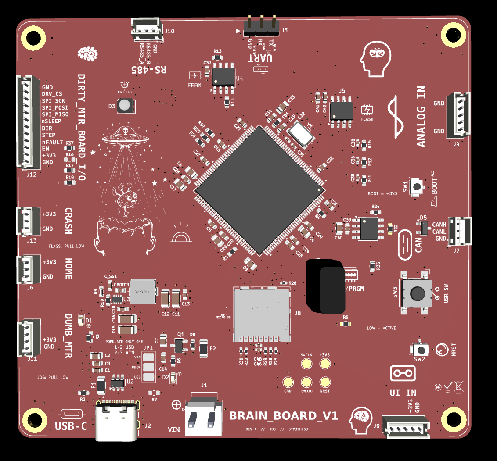
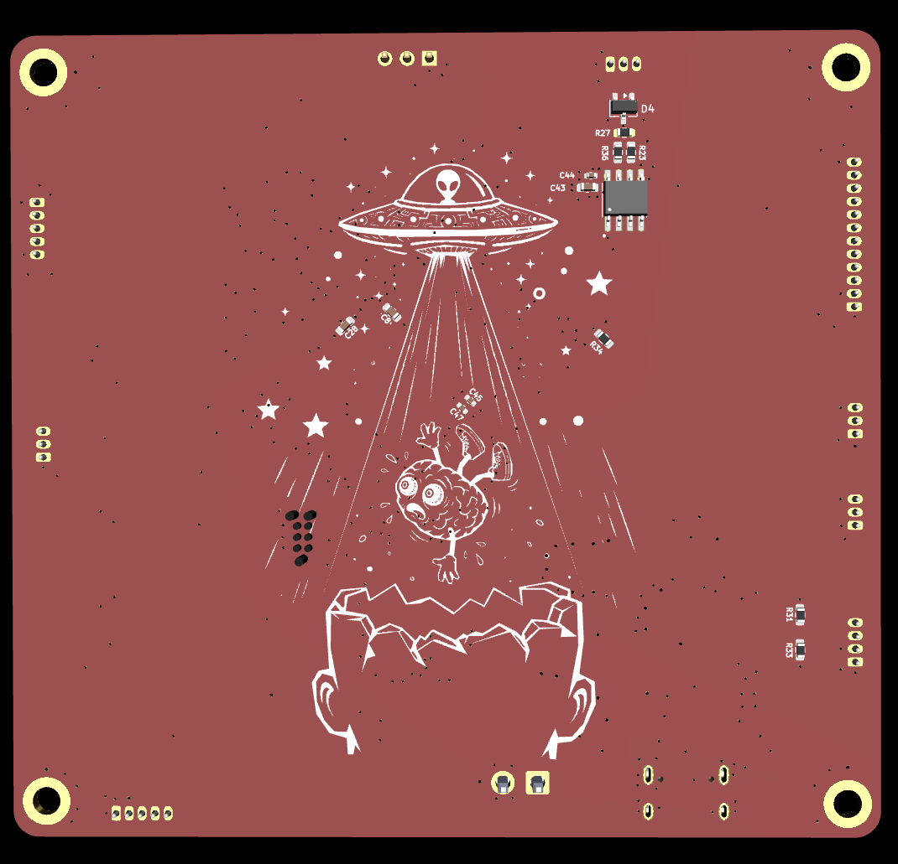

# brain_board
Custom STM32H753 brain board with USB-C power/input selection, 3.3V buck regulation, microSD, CAN, RS-485, FRAM, flash, debug/programming access, and expansion connectors.

STM32H753-based main controller board for modular motion and control projects.

Brain_Board is the central controller in a modular hardware system. It handles the clean logic side of the design: MCU control, communication, debugging/programming, storage, sensor inputs, and daughter-board interfaces. Noisy power and motor-driving jobs are moved onto external boards such as Dirty_MTR_Board.

## Overview

Brain_Board is built around the STM32H753 in an LQFP-144 package. The board is intended as a reusable controller platform for future daughter boards, including motor driver boards, manual jog input boards, sensor boards, and communication/control modules.


## Key Specs

| Item | Value |
|---|---|
| MCU | STM32H753ZITx |
| Package | LQFP-144 |
| Logic rail | +3.3 V |
| USB | USB-C |
| External communication | RS485, CAN |
| Storage | microSD |
| Nonvolatile memory | SPI FRAM |
| Debug/programming | SWD / debug UART headers |
| Daughter-board support | Motor/control, analog I/O, manual jog, external flags |
| Power options | USB or VIN path with jumper selection |
| Board role | Main controller / system brain |

## Main Features

- STM32H753 main MCU
- USB-C connector for USB data/power path
- USB VBUS fused input
- VIN input path
- Jumper-selectable power source
- +3.3 V regulation and local decoupling
- RS485 transceiver interface
- CAN interface connector
- SPI FRAM
- microSD card interface
- SWD programming/debug header
- Debug UART header
- User switch
- Boot button
- Reset button
- Status LEDs
- Analog input header
- Daughter-board connectors
- Motor-control signals routed to external motor driver board
- Active-low home/crash/manual-jog style inputs
- Labeled test points and silkscreen notes

## System Role

Brain_Board is the clean logic/control board.

It does **not** directly drive the stepper motor coils. Motor power and phase switching are handled by a dedicated daughter board such as the Dirty_MTR_Board.

Typical system stack:
Host / USB / RS485 / CAN
        ↓
Brain_Board
        ↓
STEP / DIR / SPI / GPIO
        ↓
Dirty_MTR_Board
        ↓
Stepper motor
# BRAIN_BOARD

<p align="center">
  
</p>

<p align="center">
  
</p>

Custom STM32H753 main controller board for modular motion, control, storage, communication, and daughter-board expansion.

BRAIN_BOARD is the clean logic/control board in a modular hardware system. It handles MCU control, communication, debugging/programming, storage, sensor inputs, and daughter-board interfaces. Noisy motor power and phase switching are kept on external boards such as DIRTY_MTR_BOARD.

## Project Status

In progress. Main controller schematic and PCB layout under development/review.

## System Role

```text
Host / USB / RS485 / CAN
        ↓
BRAIN_BOARD
        ↓ STEP / DIR / SPI / GPIO
DIRTY_MTR_BOARD / daughter boards
        ↓
Motor / sensors / external hardware
```

BRAIN_BOARD does not directly drive stepper motor coils. Motor current, switching, and noisy power handling belong on dedicated daughter boards.

## Key Specs

| Item | Value |
|---|---|
| MCU | STM32H753ZITx |
| Package | LQFP-144 |
| Logic rail | +3.3V |
| USB | USB-C |
| External communication | RS485, CAN |
| Storage | microSD |
| Nonvolatile memory | SPI FRAM |
| Debug/programming | SWD / debug UART headers |
| Daughter-board support | Motor/control, analog I/O, manual jog, external flags |
| Power options | USB or VIN path with jumper selection |
| Board role | Main controller / system brain |

## Main Features

- STM32H753 main MCU
- USB-C connector for USB data/power path
- USB VBUS fused input
- VIN input path
- Jumper-selectable power source
- +3.3V regulation and local decoupling
- RS485 transceiver interface
- CAN interface connector
- SPI FRAM
- microSD card interface
- SWD programming/debug header
- Debug UART header
- User switch
- Boot button
- Reset button
- Status LEDs
- Analog input header
- Daughter-board connectors
- Motor-control signals routed to external motor driver board
- Active-low home/crash/manual-jog style inputs
- Labeled test points and silkscreen notes

## Power Architecture

BRAIN_BOARD is intended to keep logic power clean and separate from noisy motor power.

```text
USB-C / VIN input path
        ↓
power selection / protection
        ↓
+3.3V logic rail
        ↓
STM32H753 + memory + communication interfaces
```

Motor power is not generated or switched directly on BRAIN_BOARD.

## Daughter-Board Strategy

Planned or related daughter boards include:

- DIRTY_MTR_BOARD for motor driving and noisy power handling
- DUMB_MANUAL_MTR_BOARD for external manual jog buttons
- Sensor / analog input boards
- Communication or debug helper boards

Manual jog style inputs are intended to be active-low. External buttons pull the signal to GND when pressed.

## PCB Notes

Design priorities:

- Keep MCU decoupling tight and local
- Keep the ground system solid and low impedance
- Route communication interfaces cleanly
- Keep noisy motor-driver current off the main controller board
- Use clear connector labels and test points
- Preserve clean SWD/debug access


## Safety / Design Note

BRAIN_BOARD is a low-voltage controller PCB. Motor power, external loads, and high-current switching should be handled on separate boards with appropriate power routing, protection, and review.